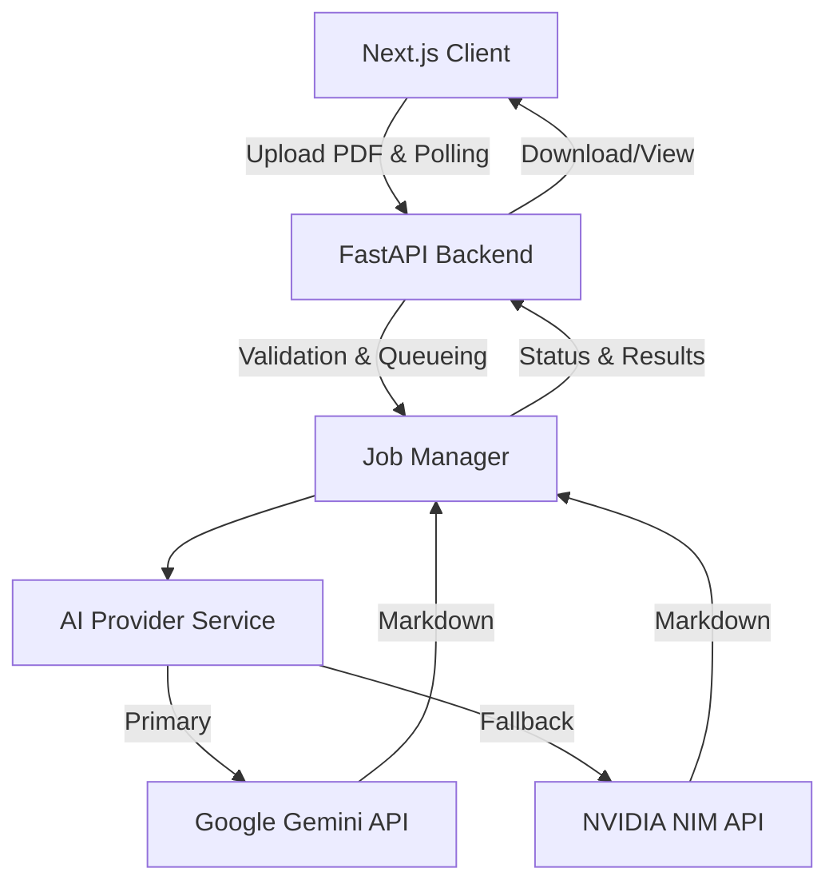

# Remarker AI

Remarker AI is a powerful application for converting dense PDF academic source material into clean, structured Markdown study notes. It provides consistent formatting across multiple AI providers including Google Gemini and NVIDIA NIM.


## Features

- **Provider-Flexible**: Seamlessly switch between Google Gemini and NVIDIA NIM.
- **Automatic Fallback**: Automatically falls back to secondary providers if the primary provider fails or rate-limits.
- **Progress Tracking**: Real-time progress indicators across 5 stages (Uploading, Parsing, Extracting, Running AI, Formatting).
- **Markdown Preview & Export**: Live preview of generated notes and instant download in Markdown or PDF formats.
- **Responsive & Accessible**: Fully responsive layout with keyboard accessibility and ARIA support.

## Architecture



## Tech Stack

**Frontend**: Next.js App Router, React, TypeScript, Tailwind CSS, shadcn/ui conventions, Motion, Zustand, TanStack Query, React Hook Form, Zod.
**Backend**: FastAPI, Python 3.10+, PyPDF, Google GenAI SDK, HTTPX (for NVIDIA NIM).

## Installation

### Prerequisites
- Node.js 18+ and `pnpm`
- Python 3.10+
- AI Provider API Keys (Gemini and/or NVIDIA NIM)

### Setup

1. **Clone and Install Frontend Dependencies**
   ```bash
   pnpm install
   ```
2. **Install Backend Dependencies**
   ```bash
   cd backend
   pip install -r requirements.txt
   ```
3. **Environment Configuration**
   Copy `.env.example` to `.env` and configure your API keys and base URLs.

## Development

### Start Backend
```bash
cd backend
python -m uvicorn app.main:app --reload --port 8000
```

### Start Frontend
```bash
pnpm dev
```
The application will be available at `http://localhost:3000`.

## Deployment

Remarker AI is production-ready. See [DEPLOYMENT.md](DEPLOYMENT.md) for detailed instructions on deploying the frontend to Vercel and the backend to Render using Docker.

## Folder Structure

```text
src/
  app/          Next.js routes, layouts, and app providers.
  components/   Feature components like upload-card.
  shared/       Reusable UI, layouts, icons, and animation tokens.
  services/     Integration boundaries and shared clients.
  config/       Application configuration.

backend/
  app/
    api/        FastAPI route definitions.
    core/       Configuration and settings.
    models/     Pydantic schemas.
    services/   Job manager and AI provider integrations.
    utils/      File handling and helper functions.
```

## Roadmap
- [ ] Add user accounts and history persistence.
- [ ] Support custom local AI models via Ollama.
- [ ] Add direct PDF viewer alongside markdown.
